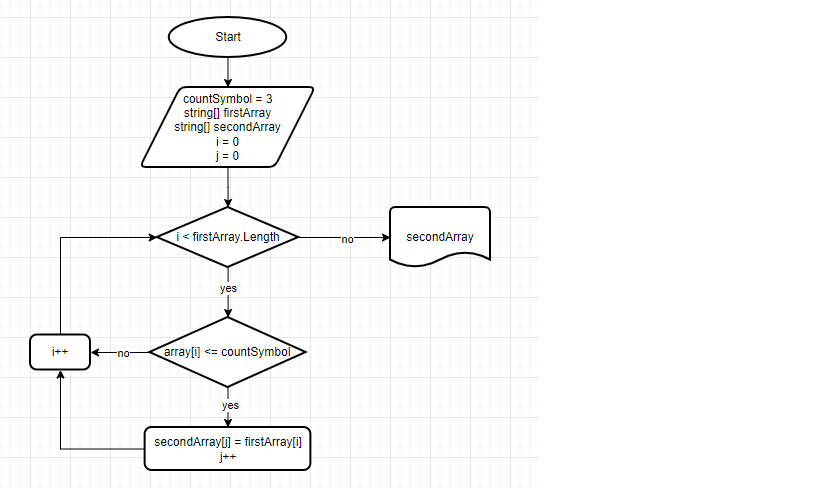

# Итоговая контрольная работа по основному блоку.

* ## Задача

*Написать программу, которая из имеющегося массива строк формирует новый массив из строк, длина которых меньше, либо равна 3 символам. Первоначальный массив можно ввести с клавиатуры, либо задать на старте выполнения алгоритма. При решении не рекомендуется пользоваться коллекциями, лучше обойтись исключительно массивами.*

[“Hello”, “2”, “world”, “:-)”] → [“2”, “:-)”]
[“1234”, “1567”, “-2”, “computer science”] → [“-2”]
[“Russia”, “Denmark”, “Kazan”] → []

* ## Алгоритм решения

1. Создали массив (метод **GetArray**).
2. Вывели его (метод **PrintArray**).
3. Нашли количество элементов массива длина которых меньше, либо равна 3 символам, если они есть (метод **SizeSecondArray**).
4. Сформировали из созданного массива новый, длина элементов которого меньше, либо равна 3 символам (метод **TransferArray**).
5. Вывели его (метод **PrintArray**).

* ## Блок схема
В папку **blockTask** добавлен файл **blockTask.png** с блок-схемой алгоритма.
